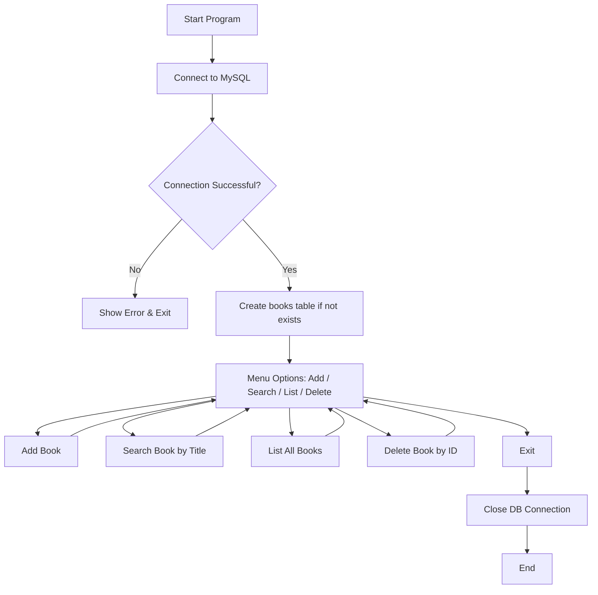

# 📚 Library Management System (Python + MySQL)

A simple Object-Oriented Library Management System built with Python and MySQL. This system allows users to:

- Add new books
- Search for books by title
- List all books
- Delete books by ID

> Built with best practices in exception handling using `try`, `except`, `else`, and `finally`.

---

## 🧠 Features

- Clean OOP architecture with a `LibraryManager` class.
- Connects to MySQL database using `mysql-connector-python`.
- Ensures table creation if not present.
- Supports all CRUD operations on the `books` table.
- Proper exception handling to manage database errors gracefully.

---

## 🛠️ Setup Instructions

### 1. Install Dependencies

```bash
pip install mysql-connector-python
```

### 2. Set Up MySQL

In your MySQL CLI or GUI, run:

```sql
CREATE DATABASE IF NOT EXISTS library;

USE library;

CREATE TABLE IF NOT EXISTS books (
  id INT AUTO_INCREMENT PRIMARY KEY,
  title VARCHAR(255),
  author VARCHAR(255),
  isbn VARCHAR(255)
);
```

### 3. Configure & Run

Replace the placeholders in the script:

```python
manager = LibraryManager(
    host="localhost",
    user="yourusername",
    password="yourpassword",
    database="library"
)
```

Then run the script with:

```bash
python lib_man.py
```

---

## 📊 System Flow (Mermaid.js)



---

## 📁 Project Structure

```
library_management/
│
├── lib_man.py     # Main Python script
├── README.md             # This documentation
```

---

## 🚀 Future Improvements

- Add a CLI-based menu for user interaction
- Add user authentication
- Track borrowing & returning of books
- Export reports to CSV/PDF

---

## 📃 License

This project is open-source and free to use for educational purposes.

---

## 💬 Contact

For improvements or questions, feel free to open an issue or contribute.
